# Redock DevStation

`Redock DevStation` is your all-in-one local development environment manager. It's a lightweight service application that brings together container management, development tools, and productivity features in a single, easy-to-use platform.

---

## Feature Overview

| Area | Highlights |
|------|------------|
| **API Gateway** | HTTP/HTTPS routing, priority-based matching, per-route auth, rate limiting, health checks, observability exporters, automatic TLS, and hot reloads |
| **Client Protection** | Real-time client tracking, auto-blocking based on configurable thresholds, manual block list with persistence, and top-client analytics |
| **Container & Dev Environments** | Docker lifecycle manager, service templates, environment bootstrap scripts, and redeploy helpers for consistent developer machines |
| **Networking Toolkit** | Local HTTP proxy, tunnel proxy, embedded SSH server, and secure remote access helpers for on-prem or cloud workloads |
| **Developer Productivity** | Saved commands, script launcher, PHP Xdebug adapter, local proxy controller, and WebSocket tooling to streamline daily workflows |
| **Operations & Automation** | Service install/start/stop/uninstall commands, self-update hooks, deployment helpers, and systemd-friendly logging |
| **Observability** | Built-in stats dashboard, telemetry exporters (Loki, InfluxDB, Graylog, OTLP, ClickHouse), and configurable batch/flush policies |
| **Modern Web UI** | Vue 3 + Tailwind dashboard with route/service editors, certificate manager, client insights, and modal-driven workflows |

---

## Screenshots

<div align="center">

### Dashboard Overview

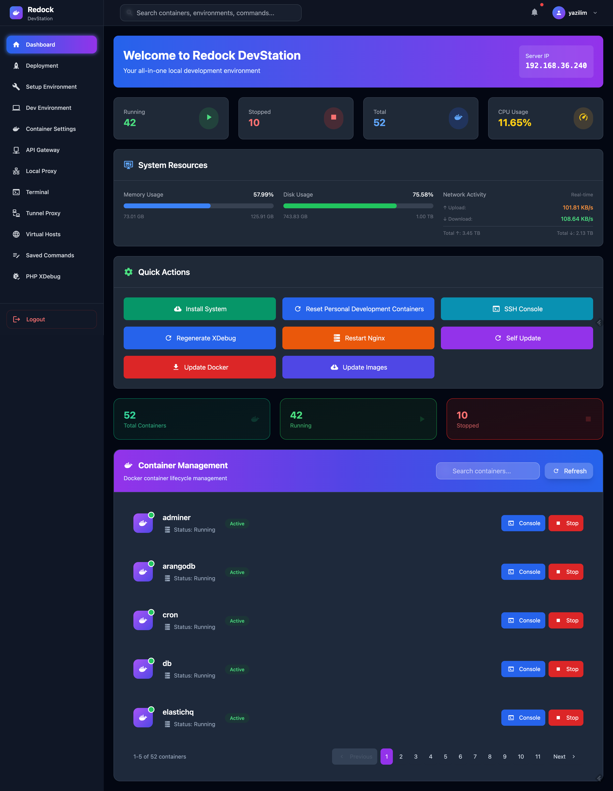

### API Gateway Management

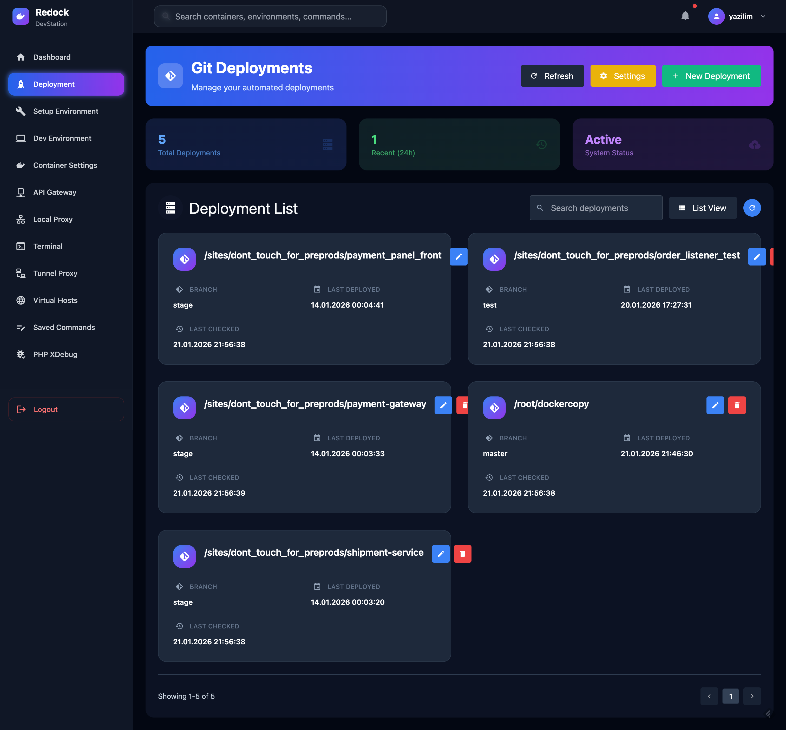

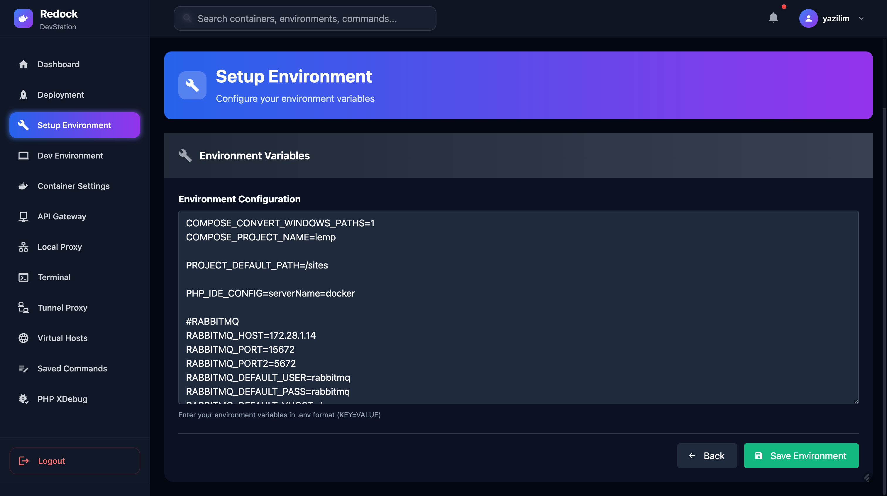

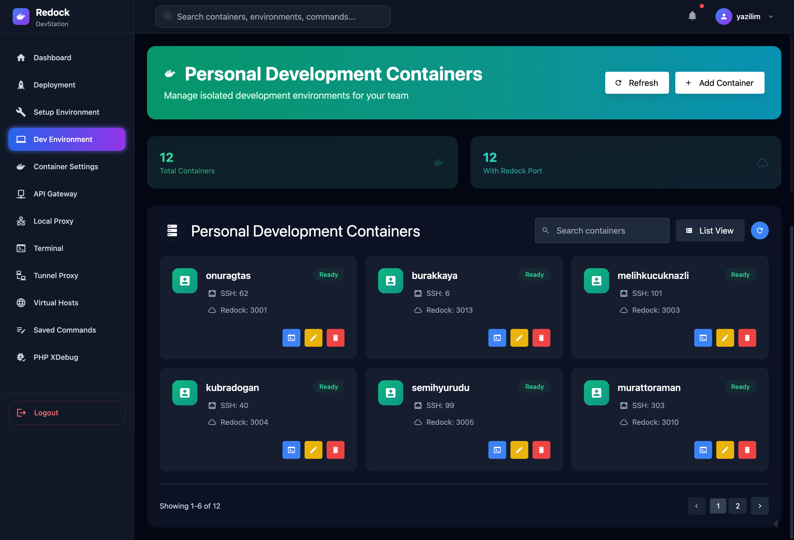

### Client Management & Security

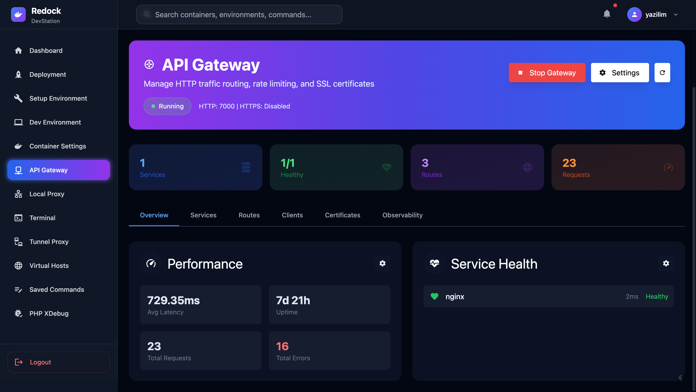

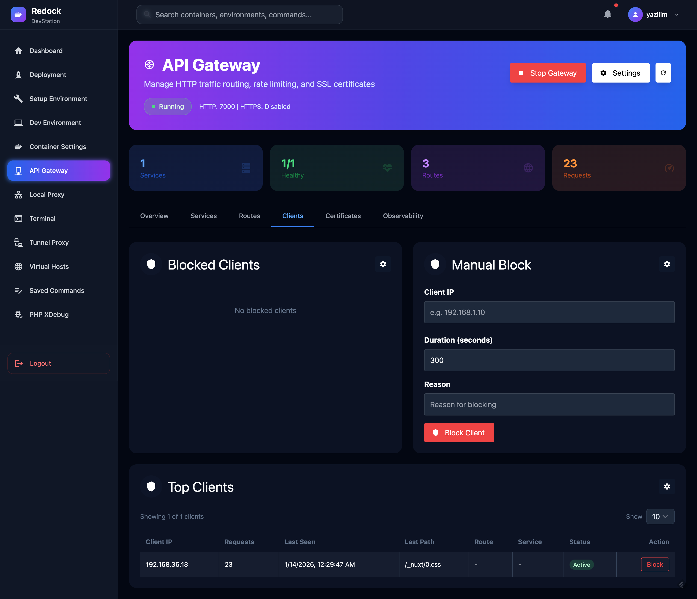

### Deployment & Container Management

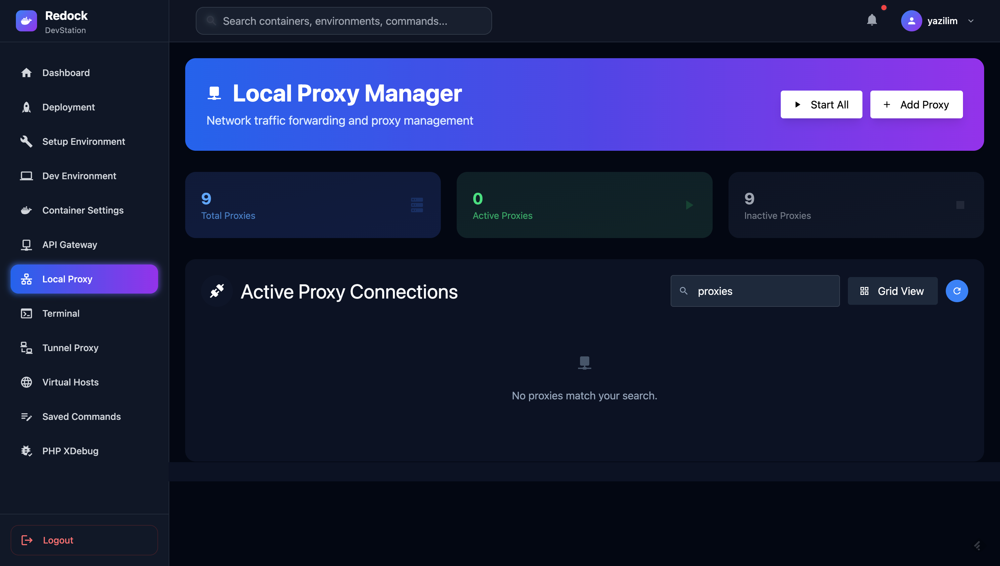

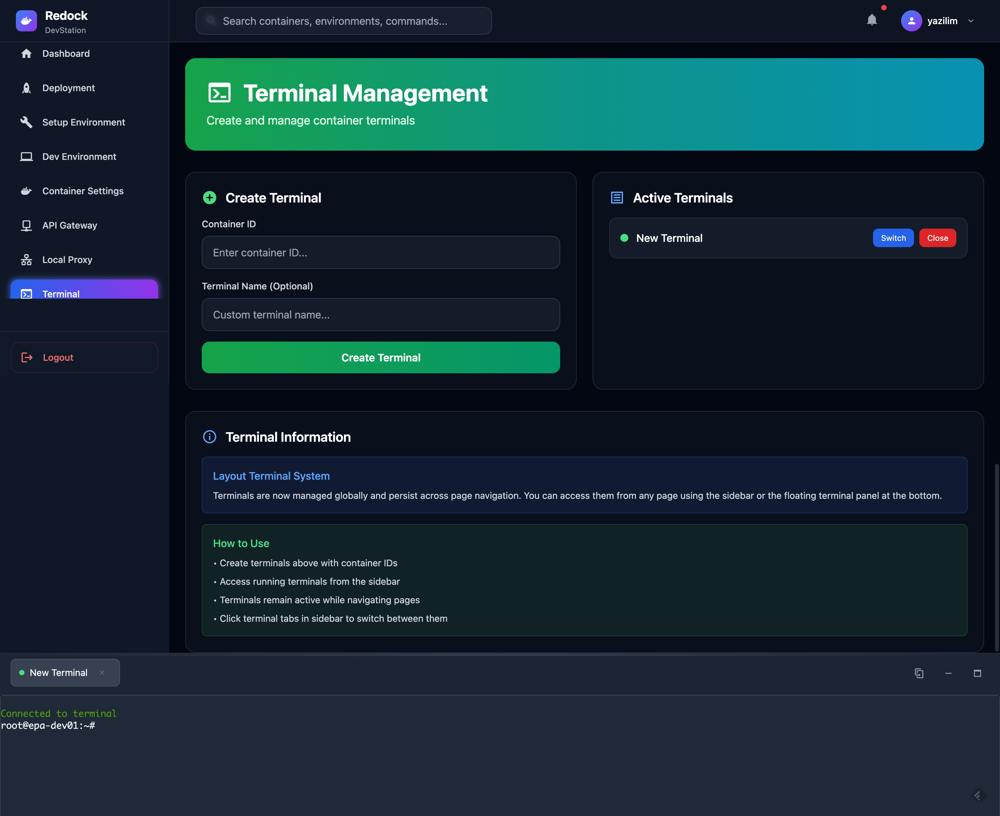

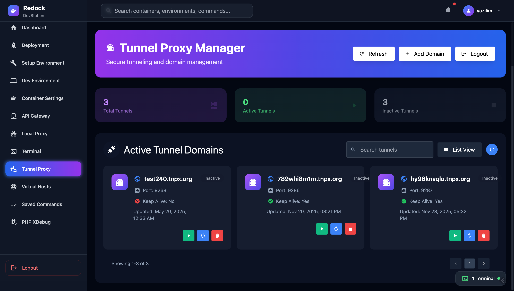

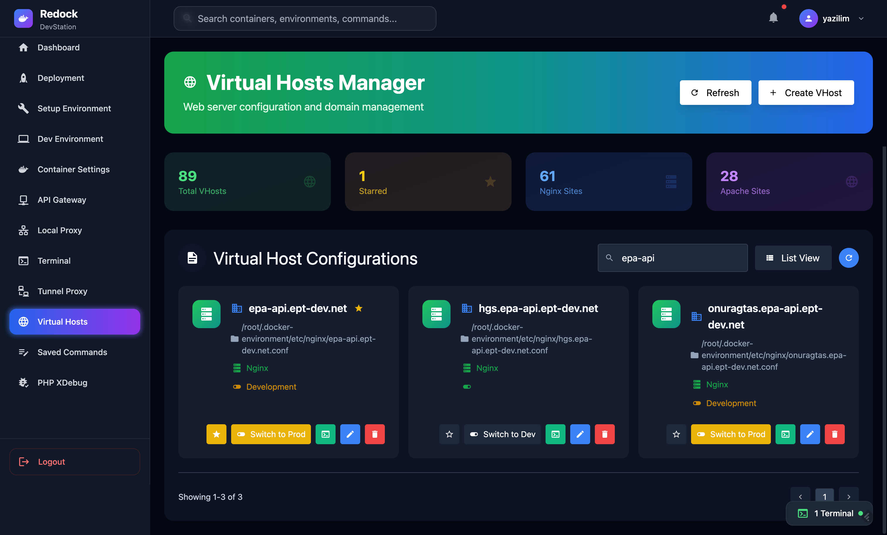

### Advanced Features

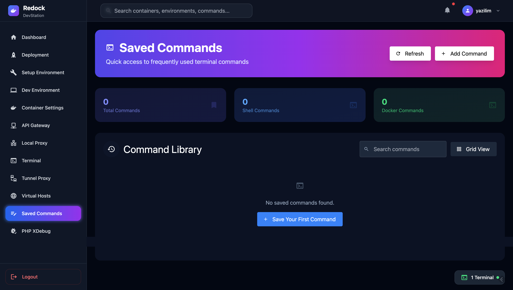

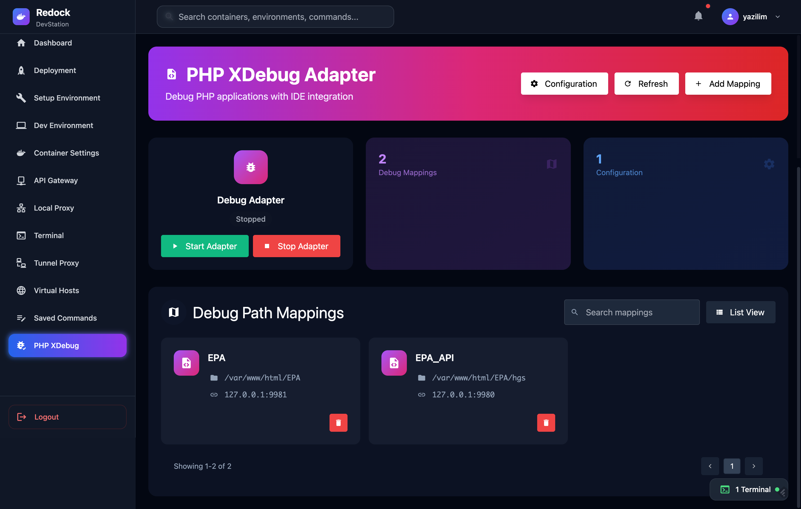

</div>

---

## Detailed Capabilities

### API Gateway & Traffic Management
- HTTP and HTTPS listeners with automatic TLS cert loading plus optional Let's Encrypt provisioning and renewal scheduler.
- Route engine with priority sorting, host/path matching, method filtering, header rules, path stripping, and per-route observability toggles.
- Upstream service registry with health checks, retries, protocol/timeout controls, and aggregated service stats.
- Global and per-route rate limiters, JWT/basic/API-key authentication hooks, and reverse proxy logging (request/response bodies with truncation safeguards).
- Route cache, client-aware logging (X-Forwarded-* headers), and on-demand validation/testing helpers.

### Client Security & Telemetry
- Configurable client tracking (up to 1000 entries) with last-path/status metadata and consecutive miss counting.
- Auto-block policies based on unmatched-route thresholds and block duration controls, plus manual block entries persisted to disk.
- Block list import/export, JSON persistence, and UI-driven unblock workflows.
- Observability exporters for Loki, InfluxDB, Graylog, OTLP, and ClickHouse with batching/flush intervals and credential fields.
- Request log streaming to telemetry exporters with per-route override switches.

### Container & Environment Automation
- Docker environment manager (`docker-manager/`) handling config parsing, virtual host mapping, and lifecycle orchestration.
- Deployment/devenv helpers for initializing project templates, migrations, and stack-specific tooling.
- Saved command catalog plus command execution controller to keep frequently used scripts in one place.

### Networking, Proxying & Remote Access
- Local HTTP proxy service for routing dev traffic between containers and host.
- Tunnel proxy plus companion SSH server for exposing local services securely.
- PHP Xdebug adapter with Fiber-based controller for seamless debugging sessions from the dashboard.
- Support for manual and auto-managed tunnels via WebSocket controllers.

### Developer Productivity Suite
- Terminal-like saved command runner, credentials helpers, JWT utilities, and password generators inside `pkg/utils`.
- Auth/token management APIs with Fiber middleware for JWT verification and role-based guards.
- Web UI sections for services, routes, clients, certificates, observability, and saved commands with responsive layout.

### Operations & Service Management
- Cross-platform binaries (macOS, Linux, Windows) with `--action install|start|stop|uninstall` flags for service control.
- Self-update module for fetching the latest release metadata and applying updates.
- Logging utilities with structured output, rotating blocklists, and Go-based CLI for headless environments.

## Subsystem Inventory

### Core Runtime Services
- `api_gateway/` – primary reverse proxy with routing, TLS termination, rate limiting, auth, health checks, observability exporters, and configuration persistence.
- `local_proxy/` – persistent TCP/HTTP proxy list with per-port bridging between localhost and remote hosts/ports plus JSON-backed auto-start state.
- `tunnel_proxy/` – secure remote tunnel client with domain management, login/registration, renewals, and fine-grained tunnel lifecycle commands.
- `docker-manager/` – shared Docker environment manager that tracks workdir state, service metadata, and provides helpers for every module interacting with containers.
- `php_debug_adapter/` – Fiber-powered adapter that provisions PHP Xdebug sessions and exposes IDE-friendly endpoints.
- `saved_commands/` – CRUD store for frequently used shell commands, syncing with the dashboard for one-click execution.
- `ssh_server/` – embedded SSH daemon (port 2222, private-network gated) giving sandboxed shell access via PTY handling and resize-aware sessions.
- `selfupdate/` – release metadata fetcher plus semantic version comparison to download/install newer binaries safely.

### Automation & Environment Tooling
- `deployment/` – Git-driven deployment scheduler that clones repos, watches branches, runs health scripts, and executes custom deployment scripts per project on change detection.
- `devenv/` – developer environment orchestrator: manages per-user containers, ensures unique port assignments, regenerates environments via shell automation, and persists credentials.
- `local_proxy/` + `docker-manager/` tie-ins – automatically map container services to host ports for hybrid development.
- `saved_commands/`, `pkg/routes/saved_commands_routes.go` – UI + API for curated automation snippets.

### Platform Connectors
- `platform/cache/redis.go` – Redis connection factory with pooling.
- `platform/database/mysql.go`, `platform/database/postgres.go`, `platform/database/open_db_connection.go` – unified DB access helpers for MySQL & PostgreSQL plus migration runner support.
- `platform/migrations/` – SQL up/down migrations for bootstrapping Redock metadata tables.

### Application Layer (REST & WebSockets)
- `app/controllers/` – Fiber controllers for auth, Docker ops, deployments, proxies, tunnels, saved commands, PHP debugger, local proxy management, WebSockets, and token minting.
- `app/models/` – request/response schema definitions for auth, tokens, docker actions, and user entities.
- `app/queries/` – user persistence queries and helpers.
- `pkg/middleware/` – Fiber HTTP middleware (CORS, logging, JWT guards) plus telemetry injection.
- `pkg/routes/` – router definitions for public/private APIs, Swagger docs, tunnel, deployment, proxy, saved commands, and WebSocket endpoints.
- `pkg/utils/` – credential builders, JWT generator/parser, password generator, URL builders, validator helpers, and server bootstrap utilities.

### Networking, Proxying & Remote Access
- `local_proxy/` – user-defined proxy list with auto start/stop per entry, JSON persistence, and CLI/API controls.
- `tunnel_proxy/` + `app/controllers/tunnel_controller.go` – domain list/renew, tunnel start/stop, account lifecycle.
- `ssh_server/` – private-network-limited SSH access for automation and remote shell tasks.
- `websocket_controller.go` – multiplexed websocket support for real-time dashboard updates.

### Frontend & UX
- `web/` – Vue 3 + Tailwind single-page app providing dashboards for services, routes, clients, certificates, observability, deployments, tunnels, saved commands, and logs.
- `web/src/views/ApiGateway.vue` – rich UI for everything in the API Gateway (client analytics, block lists, TLS, observability, route/service CRUD, manual blocks, certificates).
- `docs/` – generated Swagger/OpenAPI artifacts plus documentation portal scaffolding.

### Documentation & Specs
- `docs/` – API docs, swagger JSON/YAML, and Go doc generator harness.
- `pkg/PROJECT_SPECIFIC.md`, `app/BUSINESS_LOGIC.md`, `platform/PLATFORM_LEVEL.md` – architectural guidance for each layer.

### Supporting CLIs & Scripts
- `service.go`, `init.go`, `app_version.go`, `version.go` – CLI entrypoints, versioning, and service bootstrap.
- `Makefile` – helper targets for lint/test/build and web asset generation.
- `saved_commands/`, `devenv/serviceip.sh` (invoked) – maintained library of automation scripts accessible from the UI and CLI.

---

## Requirements
- A compatible platform:
  - **macOS**
  - **Linux**
  - **Windows**
- Administrator/root access for managing services.
- Optional: **Go** (if building from source).

---

## Download and Run
### For macOS

<details>
<summary>Apple Silicon</summary>

```bash
wget https://github.com/onuragtas/redock/releases/latest/download/redock_Darwin_arm64 -O /usr/local/bin/redock
chmod +x /usr/local/bin/redock
redock
```

</details>

<details>
<summary>AMD64</summary>

```bash
wget https://github.com/onuragtas/redock/releases/latest/download/redock_Darwin_amd64 -O /usr/local/bin/redock
chmod +x /usr/local/bin/redock
redock
```

</details>

---

### For Linux

<details>
<summary>Download and Run</summary>

Download the latest release:

```bash
wget https://github.com/onuragtas/redock/releases/latest/download/redock_Linux_amd64 -O /usr/local/bin/redock
chmod +x /usr/local/bin/redock
```

Run the application:

```bash
redock
```

</details>

---

## Service Management

The application supports the following service management actions:

| Action      | Description                 |
|-------------|-----------------------------|
| `install`   | Installs the service.       |
| `start`     | Starts the service.         |
| `stop`      | Stops the running service.  |
| `uninstall` | Removes the installed service. |

### Command Syntax
```bash
redock --action [install|start|stop|uninstall]
```

### Example Commands
- Install the service:
  ```bash
  redock --action install
  ```
- Start the service:
  ```bash
  redock --action start
  ```
- Stop the service:
  ```bash
  redock --action stop
  ```
- Uninstall the service:
  ```bash
  redock --action uninstall
  ```

---

## Building from Source
To build the application locally:
1. Clone the repository:
   ```bash
   git clone <repository-url>
   cd <repository-folder>
   ```

2. Install dependencies and build the web UI:
   ```bash
   cd web
   npm install && npm run build
   ```

3. Build the binary:
   ```bash
   cd ..
   go build -o redock
   ```

4. Move the binary to a location in your `PATH`, such as `/usr/local/bin`:
   ```bash
   mv redock /usr/local/bin/
   ```

---

## Logging
Service logs are printed to the console by default. For advanced logging, redirect output to a file:
```bash
redock > redock.log 2>&1
```

---

## Troubleshooting
- Ensure the application has proper permissions (e.g., run with `sudo` on Linux/macOS).
- Check service status:
  - **Linux/macOS**: `systemctl status redock`
  - **Windows**: Use the Services manager.

---


## License
This project is licensed under the MIT License. See the `LICENSE` file for more details.


